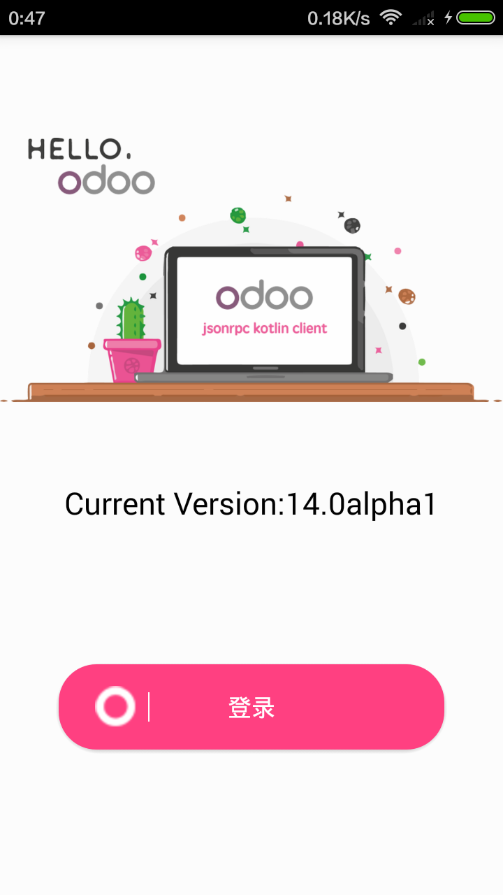
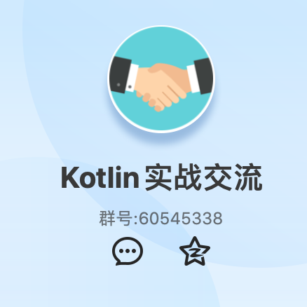

# Odoo 安卓原生客户端

<p align="center">
    <a href="art/launcher.png">
        
    </a>
</p>

## Android平台，用Kotlin编写的Odoo原生客户端，经由Odoo的/jsonrpc入口，编码进行中...

## 特性
:white_check_mark:  开发语言: 主干程序完全是Kotlin，部分第三方库仍旧用Java :scream: :heart: <br/>
:white_check_mark:  架构清晰: 主流MVP架构，依赖注入 <br/>
:white_check_mark:  风格设计: Material风格 <br/>
:white_check_mark:  自定义组件: 进度条, 导航栏, 对话框等... <br/>
:white_check_mark:  增强Tweak 1: Python返回的json数据，在Gson下int会被cast成double，利用反射替换Adapter完美解决 <br/>
:white_check_mark:  增强Tweak 2: 处理Python返回数据中的任意动态值 <br/>
:white_check_mark:  第三方库: <br/>
   * [BaseMVP](https://github.com/armcha/MVP-Architecture-Components) - for MVP architecture<br/>
   * [Dagger 2](https://github.com/google/dagger) - for dependency injection<br/>
   * [RxJava 2, RxAndroid 2](https://github.com/ReactiveX/RxJava) - for data manipulation<br/>
   * [Architecture components](https://developer.android.com/topic/libraries/architecture/index.html) - ViewModel and LifeCycle<br/>
   * [Glide](https://github.com/bumptech/glide) - for image loading<br/>
   * [Gson](https://github.com/google/gson) - for serialization and deserialization<br/>
   * [Retrofit](https://github.com/square/retrofit) - for HTTP requests<br/>
   * [Room](https://developer.android.com/topic/libraries/architecture/room.html) - for data persistence<br/>
   * [Leak canary](https://github.com/square/leakcanary) - for memory leak detection<br/>
   * [Logger](https://github.com/armcha/logger) - for simple logging<br/>
    
## 待完成
:white_large_square: 更多功能 <br/>
:white_large_square: 测试 <br/> 

## 截屏

| Login     | 
| :-------------: | 
|  | 

## 编译
### 开发环境 Android Studio
```
git clone https://github.com/glovebx/odoo-jsonrpc-kotlin-client.git
``` 
 
## 联系

提交PR或者Issue

- **Website**: https://glovebx.github.io/
- **QQ Group**: 60545338
<p align="left">
    <a href="art/kotlin_qq_group.png">
        
    </a>
</p>

## 鸣谢

感谢armcha的Ribble项目提供了出色的架构参考


License
--------


      Simple Odoo Client
      Copyright (c) 2019 glovebx (https://github.com/glovebx/).

      Licensed under the GNU GENERAL PUBLIC LICENSE Version 3 (the "License");    
